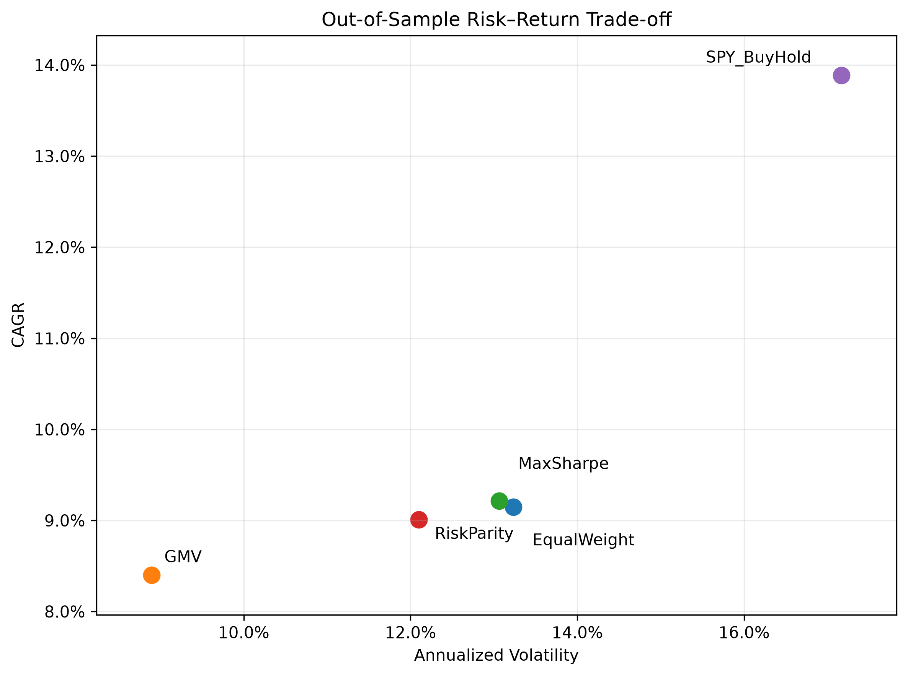
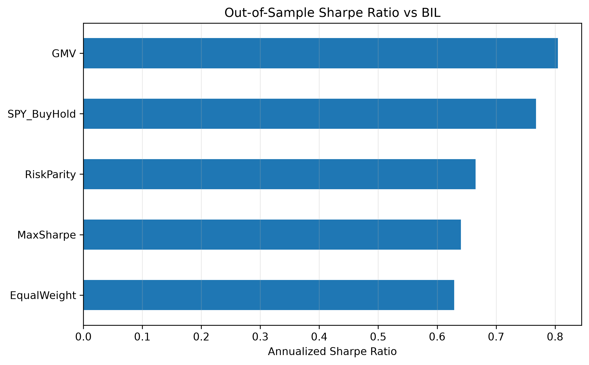
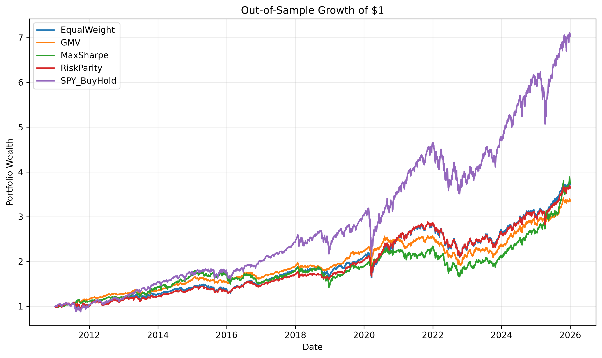

# Robust Portfolio Optimization and Risk Management with Out-of-Sample Backtesting

## Overview

This project investigates whether portfolio optimization methods deliver more robust out-of-sample performance than simple allocation rules.

Rather than evaluating optimized portfolios on the same historical sample used to estimate their parameters, I implement a rolling out-of-sample backtesting framework with transaction costs, portfolio rebalancing, downside-risk metrics, and robustness checks.

The central research question is:

> **Do optimized portfolios improve out-of-sample risk-adjusted performance relative to a simple equal-weight portfolio and passive S&P 500 investment?**

The analysis compares four allocation strategies:

1. Equal Weight
2. Global Minimum Variance (GMV)
3. Maximum Sharpe Ratio
4. Risk Parity


A passive SPY buy-and-hold portfolio is included as an external benchmark.

---

## Asset Universe

The portfolio contains eight liquid ETFs representing multiple asset classes, equity styles, and geographic exposures:

| Ticker | Exposure                           |
| ------ | ---------------------------------- |
| SPY    | U.S. large-cap equities            |
| QQQ    | U.S. technology / growth equities  |
| IWM    | U.S. small-cap equities            |
| EFA    | Developed markets outside the U.S. |
| EEM    | Emerging-market equities           |
| TLT    | Long-term U.S. Treasury bonds      |
| GLD    | Gold                               |
| VNQ    | U.S. real estate                   |

BIL, a 1–3 month U.S. Treasury Bill ETF, is used as a practical cash proxy for excess-return calculations. 

---

## Data

- Frequency: Daily
- Sample: January 2010 – December 2025
- Out-of-sample evaluation period: January 2011 – December 2025
- Price field: Dividend- and split-adjusted close
- Source: Tiingo
- Observations: 4,024 trading days
- Missing observations across the eight-ETF price matrix: 0


Adjusted prices are used so that total-return comparisons are not distorted by differences in dividend distributions or stock splits.

---

## Exploratory Findings

The asset universe exhibits substantial cross-asset diversification potential.

Equity ETFs are strongly correlated. For example:

- SPY–QQQ correlation: 0.932
- SPY–IWM correlation: 0.884
- SPY–EFA correlation: 0.857


In contrast:

- SPY–TLT correlation: -0.298
- SPY–GLD correlation: 0.053


This provides an empirical motivation for including Treasuries and gold rather than optimizing only within equities.

The return distributions also exhibit meaningful tail risk. Excess kurtosis is high for several assets, supporting the use of downside-risk measures such as VaR, CVaR, and maximum drawdown in addition to volatility.

---

## Methodology

### Rolling Out-of-Sample Framework

To reduce look-ahead bias, portfolio weights are estimated using only information available before each rebalancing date.

The backtest uses:

- 252 trading-day estimation window
- 21 trading-day holding period
- Monthly-style rebalancing
- Long-only positions
- Fully invested portfolios
- No leverage
- No short selling
- 10 basis points transaction cost per unit of portfolio turnover


At each rebalance:

1. The previous 252 trading days are used to estimate model parameters.
2. New target weights are calculated.
3. Transaction costs are deducted based on portfolio turnover.
4. The portfolio is held for the following 21 trading days.
5. Asset weights are allowed to drift naturally between rebalancing dates.
6. The process repeats through the end of the sample.


This design avoids optimizing and evaluating portfolios on the same sample.

---

## Portfolio Strategies

### Equal Weight

Each of the eight assets receives an initial target weight of:

\[
w_i = \frac{1}{N}
\]

This serves as the main simple-allocation benchmark.

### Global Minimum Variance

The GMV portfolio solves:

\[
\min_w w^\top \Sigma w
\]

subject to:

\[
\sum_i w_i = 1
\]

and:

\[
0 \leq w_i \leq 1
\]

The strategy depends primarily on covariance estimates rather than expected-return forecasts.

### Maximum Sharpe

The return-driven optimizer maximizes the estimated return-to-volatility ratio:

\[
\max_w
\frac{w^\top \mu}
{\sqrt{w^\top \Sigma w}}
\]

The optimization stage assumes a zero risk-free rate. Final ex-post risk-adjusted performance is evaluated separately relative to BIL.

### Risk Parity

Risk Parity seeks to distribute portfolio variance contributions more evenly across assets instead of allocating equal amounts of capital.

---

## Key Visual Results


### Risk–Return Trade-off





### Sharpe Ratio Comparison





### Wealth Growth




## Out-of-Sample Results

Final results after transaction costs are:

| Strategy       | CAGR   | Annualized Volatility | Sharpe vs BIL | Sortino vs BIL | Maximum Drawdown | Daily VaR 95% | Daily CVaR 95% |
| -------------- | ------:| ---------------------:| -------------:| --------------:| ----------------:| -------------:| --------------:|
| Equal Weight   | 9.15%  | 13.23%                | 0.629         | 0.878          | -27.19%          | 1.23%         | 1.95%          |
| GMV            | 8.40%  | 8.89%                 | 0.805         | 1.139          | -25.78%          | 0.88%         | 1.28%          |
| Max Sharpe     | 9.21%  | 13.06%                | 0.640         | 0.896          | -29.10%          | 1.27%         | 2.01%          |
| Risk Parity    | 9.01%  | 12.10%                | 0.665         | 0.931          | -26.57%          | 1.13%         | 1.80%          |
| SPY Buy & Hold | 13.89% | 17.17%                | 0.768         | 1.077          | -33.70%          | 1.64%         | 2.62%          |

---

## Key Findings

### 1. Passive SPY generated the highest absolute return

SPY achieved a CAGR of 13.89%, substantially higher than any diversified strategy.

This reflects the strong performance of U.S. large-cap equities during much of the 2011–2025 sample.

However, the higher return came with substantially greater risk:

- Annualized volatility: 17.17%
- Maximum drawdown: -33.70%
- 95% daily CVaR: 2.62%


Therefore, the optimized portfolios should not be interpreted as attempts to mechanically outperform SPY on absolute returns.

---

### 2. GMV delivered the strongest risk-adjusted performance

GMV achieved:

- 8.40% CAGR
- 8.89% annualized volatility
- 0.805 Sharpe ratio versus BIL
- 1.139 Sortino ratio versus BIL


Compared with the equal-weight portfolio, GMV reduced annualized volatility from 13.23% to 8.89%, approximately a one-third reduction.

It also reduced:

- Daily 95% VaR from 1.23% to 0.88%
- Daily 95% CVaR from 1.95% to 1.28%


GMV therefore sacrificed some absolute return while producing substantially more efficient risk exposure.

---

### 3. Return-driven optimization was unstable out of sample

The Maximum Sharpe strategy produced a slightly higher CAGR than Equal Weight:

- Max Sharpe: 9.21%
- Equal Weight: 9.15%


However, this small return advantage came with significantly greater portfolio instability.

Its annualized turnover was approximately 2.89, compared with only 0.15 for Equal Weight.

The optimizer also produced highly concentrated allocations:

- Average maximum asset weight: 59.1%
- Median maximum asset weight: 53.5%
- Maximum observed single-asset weight: 100%


This illustrates a well-known limitation of mean-variance optimization: estimated expected returns are noisy, and optimization can amplify relatively small estimation errors into extreme portfolio weights.

---

### 4. Risk Parity provided a stable middle ground

Risk Parity achieved:

- 9.01% CAGR
- 12.10% annualized volatility
- 0.665 Sharpe ratio versus BIL
- -26.57% maximum drawdown


Its performance remained relatively close to Equal Weight while reducing volatility and downside risk.

It also showed less concentration than GMV or Maximum Sharpe.

---

## Portfolio Allocation Patterns

Average GMV weights were approximately:

| Asset | Average Weight |
| ----- | --------------:|
| SPY   | 30.4%          |
| QQQ   | 0.6%           |
| IWM   | 1.8%           |
| EFA   | 6.5%           |
| EEM   | 1.1%           |
| TLT   | 38.6%          |
| GLD   | 20.1%          |
| VNQ   | 0.9%           |

The large allocations to Treasuries and gold are economically consistent with their low or negative historical correlations with equities.

Risk Parity produced substantially more balanced allocations across asset classes.

---

## Robustness Checks

### Transaction Costs

The strategies were evaluated under transaction costs ranging from 0 to 50 basis points per unit of turnover.

CAGR results:

| Strategy     | 0 bps | 10 bps | 25 bps | 50 bps |
| ------------ | -----:| ------:| ------:| ------:|
| Equal Weight | 9.16% | 9.15%  | 9.12%  | 9.08%  |
| GMV          | 8.47% | 8.40%  | 8.30%  | 8.13%  |
| Max Sharpe   | 9.53% | 9.21%  | 8.74%  | 7.96%  |
| Risk Parity  | 9.06% | 9.01%  | 8.93%  | 8.81%  |

Maximum Sharpe is clearly the most transaction-cost-sensitive strategy.

Its CAGR falls from 9.53% with zero costs to 7.96% at 50 bps.

Equal Weight and Risk Parity are substantially more stable.

---

### Estimation Window

The rolling estimation window was varied between:

- 126 trading days
- 252 trading days
- 504 trading days


Out-of-sample Sharpe ratios:

To isolate the effect of estimation-window length, all robustness specifications use the same out-of-sample start date (January 4, 2012).

| Strategy     | 126 Days | 252 Days | 504 Days |
| ------------ | --------:| --------:| --------:|
| Equal Weight | 0.780    | 0.780    | 0.780    |
| GMV          | 0.896    | 0.892    | 0.947    |
| Max Sharpe   | 0.763    | 0.722    | 0.873    |
| Risk Parity  | 0.755    | 0.858    | 0.859    |

GMV remains the highest-Sharpe strategy under all three estimation-window assumptions.

This provides evidence that its risk-adjusted advantage is not driven solely by the baseline 252-day parameter choice.

---

## Interpretation

The results highlight an important distinction between theoretical optimization and implementable portfolio management.

Expected-return optimization can produce attractive in-sample solutions, but expected returns are difficult to estimate precisely. Small changes in the estimated mean-return vector can lead to large changes in portfolio weights.

By contrast, covariance-based strategies such as GMV rely more heavily on relative volatility and correlation estimates, which were more stable in this experiment.

The main conclusion is therefore not that portfolio optimization universally beats passive investing.

Instead:

> **Covariance-based risk optimization produced more robust out-of-sample risk-adjusted performance, while return-driven optimization was more vulnerable to estimation error, portfolio concentration, turnover, and transaction costs.**

---

## Risk Measures

The analysis evaluates portfolios using multiple dimensions of risk:

- Annualized volatility
- Maximum drawdown
- Historical 95% Value at Risk
- Historical 95% Conditional Value at Risk
- Sharpe ratio
- Sortino ratio
- Portfolio turnover


This is important because the asset return distributions exhibit fat tails, making standard deviation alone an incomplete description of portfolio risk.

---

## Project Structure

```text
quant_portfolio_project/
│
├── data/
│   ├── adjusted_close.csv
│   ├── daily_returns.csv
│   ├── asset_summary_stats.csv
│   ├── return_correlation.csv
│   └── annual_covariance.csv
│
├── notebooks/
│   ├── 01_data_check.ipynb
│   ├── 02_returns_analysis.ipynb
│   ├── 03_baseline_risk.ipynb
│   ├── 04_rolling_oos.ipynb
│   ├── 05_visualization.ipynb
│   └── 06_final_benchmark.ipynb
│
├── outputs/
│   ├── oos_strategy_metrics.csv
│   ├── final_strategy_comparison.csv
│   ├── transaction_cost_robustness.csv
│   ├── estimation_window_robustness.csv
│   ├── 06_final_risk_return.png
│   ├── 07_final_sharpe.png
│   └── 08_final_wealth.png
│
├── report/
│   └── project_scope.md
│
├── .gitignore
└── README.md
```

## Technologies

- Python

- NumPy

- Pandas

- SciPy

- Matplotlib

- Tiingo API

- Jupyter Notebook

Optimization is implemented using constrained nonlinear optimization with SciPy's SLSQP solver.

---

## Reproducibility

API credentials are stored locally in a `.env` file and excluded from version control through `.gitignore`.

The raw API token is not included in the repository.

The main workflow is:

```
Market Data
    ↓
Adjusted Prices
    ↓
Daily Returns
    ↓
Exploratory Risk Analysis
    ↓
Rolling Portfolio Optimization
    ↓
Out-of-Sample Backtesting
    ↓
Transaction Costs
    ↓
Risk & Performance Metrics
    ↓
Robustness Checks
    ↓
Final Benchmark Comparison
```

---

## Limitations

Several limitations should be considered.

First, the results are specific to the selected ETF universe and sample period.

Second, the 2011–2025 period includes a particularly strong performance regime for U.S. equities, which contributes to SPY's high absolute return.

Third, historical covariance and expected-return estimates may not remain stable across future market regimes.

Fourth, the Maximum Sharpe optimization assumes a zero risk-free rate when estimating portfolio weights, although final performance is evaluated relative to BIL.

Fifth, transaction costs are modeled proportionally to turnover and do not explicitly include bid-ask spreads, market impact, taxes, or liquidity constraints.

Finally, the analysis does not incorporate leverage, short selling, dynamic volatility models, or forward-looking expected-return models.

These limitations are intentional: the project focuses on testing the robustness of standard portfolio construction methods under a transparent and reproducible framework.

---

## Conclusion

The experiment shows that the portfolio with the highest absolute return is not necessarily the portfolio with the strongest risk-adjusted performance.

Passive SPY exposure generated the highest CAGR over the sample, but also experienced substantially higher volatility, drawdown, VaR, and CVaR.

The Global Minimum Variance strategy produced the strongest risk-adjusted results and remained robust across alternative estimation windows.

Maximum Sharpe optimization was considerably less stable, producing concentrated portfolios, high turnover, and strong sensitivity to transaction costs.

Overall, the results support a practical lesson in quantitative portfolio management:

> **Robust risk estimation may be more valuable than aggressively optimizing noisy expected-return forecasts.**
